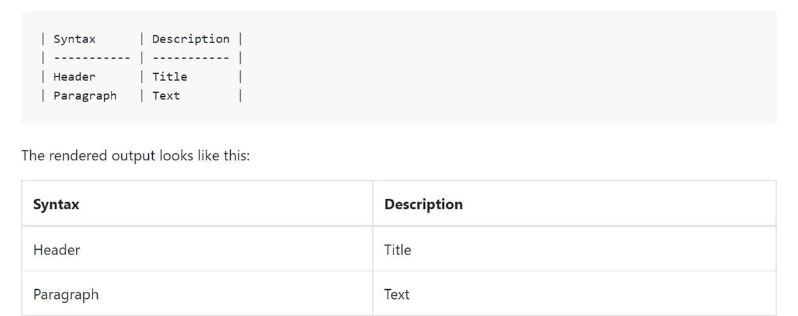

# 마크다운 정리

## 마크다운이란?

- 2004년 존 그루버가 만든 텍스트기반의 마크업 언어

### 마크다운의 특징

- 최소한의 문법으로 구조화.
- 다양한 환경에서 호환이 잘 이루어짐.

## 마크다운 문법

### 1. Heading

- 문서의 제목이나 소제목
- '#'의 개수에 따라 heading level 1 ~6 까지 가능 <br>(숫자가 커질수록 글자 크기가 작아짐.)
- 글자 크기 조절용으로 사용하지 말 것.

### 2. List

- 순서가 있는 리스트(ol) & 순서가 없는 리스트(ul)
- 순서가 있는 리스트 : 1.  2.  3.  4.  
- 순서가 없는 리스트 :  -  or  *

### 3. Fenced Code Block

- backtit(`)기호 3개를 활용.

- 특정 언어를 명시하면 Syntac Highlighting 적용.

- ex ) ```python

- ```python
  If True:
      print('Hello world')
      break
  ```

### 4. Inline Code Block

- backtit(`)기호 1개 활용
- ex ) \`code`
-  `Inline Code Block Example`

### 5. Link

- \[문자열](링크) 형식으로 사용.(괄호 사이에 띄어쓰기 X)
- ex) \[Markdown Guide](https://www.markdownguide.org/)
- [Markdown Guide](https://www.markdownguide.org/)

### 6. Image

- \!\[문자열](링크) 형식으로 사용.
- Typora에서는 이미지 파일을 Drag&Drop 하는것만으로도 쉽게 이미지 삽입 가능.

### 7. Blockquotes (인용문)

- \> 를 통해 인용문을 작성

- > ex ) Dorothy followed her thought.

### 8. Table

- 

- Pytora에서는 [본문] - [표] - [표 삽입] or [ctrl + T]로 이용 가능.

### 9. 텍스트 강조

- 굵게(bold) : 양 옆에  \** 붙임. **BOLD**
- 기울임(Italic) : 양 옆에 \* 붙임. *Italic*

### 10. 수평선

- 3개 이상의 \***, \---, \___ 사용하면 수평선 활용 가능

- ex)

  

  ***


## 추가 관련 자료

- [**GitHub Flavored Markdown**](https://github.github.com/gfm/)
- [**Mastering Markdown**](https://guides.github.com/features/mastering-markdown/)
- [**Markdown Guide**](https://www.markdownguide.org/ )

