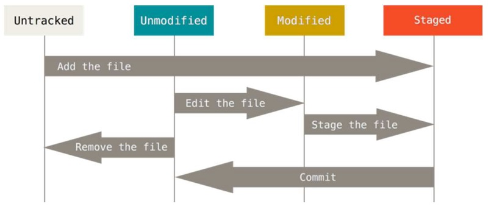

# Git 특강 (08/09 ~ 08/10)

## Git ?

- 분산버전관리시스템, 코드의 버전을 관리
- 2005년 리누스 토르발스가 개발
- 파일의 변경사항을 추적, 여러 사용자 간에 파일 작업을 조율

## 기본흐름

- **File Lifecycle** 

  

***

### Working Directory 

- Tracked : 이전부터 버전으로 관리되고 있는 파일(커밋이 된 적이 있음)

  - Unmodified : git status에 나타나지 않음
  - Modified : 파일이 수정된 상태 (커밋이 된 적이 있음)

     				Git status : **Changes not staged for commit:**

  - Staged : 수정한 파일을 곧 커밋할 것이라고 표시한 상태.

    ​			Git Status : **Changes to be committed:**

- Untracked : 한번도 커밋이 된 적 없는 파일

  ​                   Git Ststus : **Untracked files:**

  

### Staging Area

- add가 된 파일이 저장되는 곳

  

### .git Directory (Repository)

- 커밋이 된 상태의 파일.

  

  ---

  

## 기본 명령어

### init

```bash
$ git init
```

- 특정 폴더를 git 저장소로 만들어 git으로 관리할 수 있게 함.

- .git 폴더를 생성함


### add

```bash
$ git add <file>
```

- working directory상의 변경 내용을 staging area에 추가하기 위해 사용.

  - untracked → staged
  - modified → staged

  ```bash
  $ git add .		# 현재 폴더 내의 모든 파일을 add
  $ git add a.txt b.txt		# 한번에 여러개의 파일을 add 하고 싶을떄는 나열
  $ git add "*.txt"			# 특정 확장자의 파일을 전부 add 하고 싶을 때
  ```


### commit

```bash
$ git commit -m "<커밋 메세지>"
```

- staged 상태의 파일들을 커밋을 통해 버전으로 기록

- SHA-1 해시를 사용해 40자 길이의 체크섬을 생성하고, 이를 통해 고유한 커밋을 표기

- 커밋 메세지는 변경 사항을 나타낼 수 있도록 명확하게 작성해야 함.

  

### status

```bash
$ git status
```

- Git 저장소에 있는 파일의 상태를 확인.
  - 파일의 상태를 알 수 있음.
    - Untracked files
    - Changes not ataged for commit
    - changes to be commited
  - Nothing to commit, working tree clean

### log

```bash
$ git log
```

- 현재 저장소에 기록된 커밋을 조회

---


## 원격 저장소

### 원격 저장소 조회

```bash
$ git remote -v # verbose
origin  https://github.com/BijetK/test.git (fetch)
origin  https://github.com/BijetK/test.git (push)
```

### 원격저장소 추가

```bash
$ git remote add <원격저장소 이름> <주소>
$ git remote origin https://github.com/<username>/<저장소이름>.git
```

- 깃아, 원격 저장소(`remote)`를 추가해줘(`add`). `origin`이라는 이름으로, `주소`를
- 원격저장소가 이미 설정된 경우 설정이 되지 않는다. (remote origin already exist)

### 원격저장소 push

``` bash
$ git push <원격저장소이름> <브랜치이름> 		# origin을 굳이 바꾸지 말자
$ git push origin master
Enumerating objects: 4, done.
Counting objects: 100% (4/4), done.
Delta compression using up to 6 threads
Compressing objects: 100% (2/2), done.
Writing objects: 100% (3/3), 275 bytes | 275.00 KiB/s, done.
Total 3 (delta 1), reused 0 (delta 0), pack-reused 0
remote: Resolving deltas: 100% (1/1), completed with 1 local object.
To https://github.com/BijetK/test.git
   71e703f..ab4f29e  main -> main
```

- 깃, push. origin에 master 브랜치를!!
- `-u` 옵션 : upstream 옵션
  - `git push` 라고 명령을 하여도 설정된 원격저장소에 브랜치를 push
  - `git push -u origin master`

