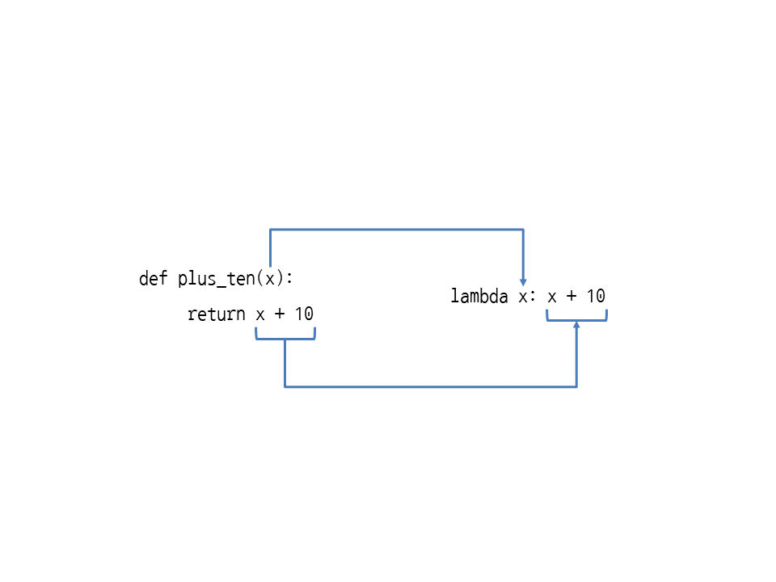

# Unit 32. Lambda 표현식

## 32.1 lambda 표현식으로 함수 만들기

지금까지 배운 0기본적인 함수 사용법은 다음과 같다.

```python
def plus_ten(x):
	return x + 10

plus_ten(1)


11
```

---

- **lambda 매개변수들: 식**

  ```python
  lambda x: x + 10
  
  <function <lambda> at 0x02C27270>
  ```

  lambda는 이름이 없는 함수(anonymous function)을 만든다.

  따라서 lambda로 만든 익명함수를 호출하려면 변수에 할당해주어야 한다.

  ```python
  plus_ten = lambda x: x + 10
  
  plus_ten(1)
  
  11
  ```

  ```bash
  (lambda x: x + 10)(1)	# 이런 방식으로 람다 표현식 자체를 호출할 수 있다
  ```

  

  

- ```python
  # 람다 표현식 안에서는 변수 생성 불가
  (lambda x: y = 10; x + y)(1)	
  SyntaxError: invalid syntax
  ```
  

- ```python
  # 람다 표현식 밖에 있는 변수는 사용 가능
  y = 10
  (lambda x: x + y)(1)
  11
  ```

- 람다 표현식을 인수로 사용

  ```python
  # 람다 표현식을 인수로
  list(map(lambda x: x + 10, [1, 2, 3]))
  [11, 12, 13]
  
  ```

## 32.2 람다 표현식과 map, filter, reduce 함수

1. 람다 조건부 표현식

   - ` lambda 매개변수들:  식 1 if 조건식 else 식2 `

     ```python
     a = [1, 2, 3, 4, 5, 6, 7, 8, 9, 10]
     list(map(lambda x: str(x) if x % 3 == 0 else x, a))
     
     [1, 2, '3', 4, 5, '6', 7, 8, '9', 10]
     ```

     

   - 조건식에 **if** 를 사용했으면 반드시 **else**를 사용해 주어야 함!!

   - **elif**는 사용 불가.

     `lmabda 매개변수들: 식1 if 조건식 1 else 식2 if 조건식2 else 식3`

2. map에 여러 객체 넣기

   ```python
   a = [1, 2, 3, 4, 5]
   b = [2, 4, 6, 8, 10]
   list(map(lambda x, y: x * y, a, b))
   
   [2, 8, 18, 32, 50]
   ```


3. Filter (함수, 반복가능한 객체)

   - 반복가능한 객체에서 조건에 맞는 요소만 가져옴.

     ```python
     def f(x):
     	return x > 5 and x < 10
     
     a = [8, 3, 2, 10, 15, 7, 1, 9, 0, 11]
     list(filter(f, a))
     
     [8, 7, 9]
     ```

   

4. reduce

   - 객체의 각 요소를 함수로 처리한 뒤 이전 결과와 누적해서 반환

   - from functools import reduce

   - redece (함수, 반복가능한객체)

     ```python
     from functools import reduce
     
     def f(x, y):
     	return x + y
     
     a = [1, 2, 3, 4, 5]
     reduce(f, a)
     
     15
     ```

     

     ```python
     # lambda 함수로
     from functools import reduce
     
     a = [1, 2, 3, 4, 5]
     reduce(lambda x, y: x + y, a)
     
     15
     ```

     

