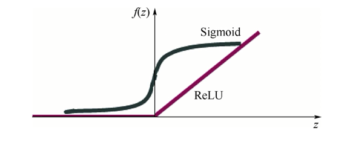
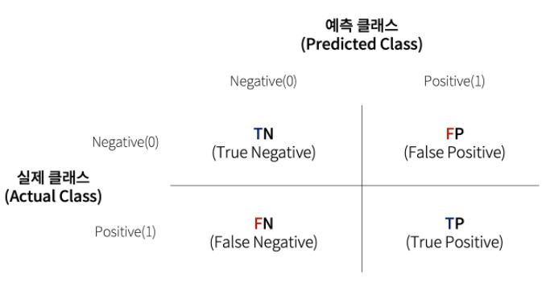

# 머신러닝

- 기계 스스로 대량의 데이터로부터 지식이나 패턴을 찾아내어 학습하는 것.

---

---

## <u>분류 (Classification) vs 회귀 (Regression)</u>

- 분류 : 미리 정의된, 가능성 있는 여러 클래스 레이블 중 하나를 예측 / 출력값에 연속성 X
- 회귀 : 연속적인 숫자, float을 예측하는 것 / 출력값에 연속성 존재


## <u>ReLu</u>

: Rectified Linear Unit

- sigmoid를 대체

  - sigmoid는 어떤 값을 넣어도 0과 1의 값을 가짐. 고로 레이어의 수가 많아질수록 입력값이 미치는 영향이 작아짐.

  - ReLu 는 0보다 작으면 0, 0보다 크면 직선의 형태로 값을 가짐.

    

  - ReLu를 쓰면 입력값이 미치는 영향을 더 잘 알 수 있다.

  - 하지만 마지막 결과를 출력하는 Output layer에서는 **sigmoid** 함수를 사용한다. 마지막 결과는 0과 1로만 나와야 하기 때문.

    

---

## <u>Grid_search</u>

- 특징 : 잠재적 Parameter들의 후보군들의 조합 중에서 <u>가장 Best 조합</u>을 찾아줌.

- 단점 : 최적의 조합을 찾을 때까지 시간이 매우 오래 걸림.

  ```python
  from sklearn.model_selection import GridSearchCV
  ```

- Parameter 정의 

  - parameter 값 : `string`값으로 지정
  - parameter 적용값 : `list`형태로 정의

  ```python
  param_grid = {
      'n_estimators': [100, 150, 200, 250],
      'max_depth': [None, 6, 9, 12],
      'min_samples_split': [0.01, 0.05, 0.1],
      'max_features': ['auto', 'sqrt'],
  }
  ```

- estimator(우리가 적용할 모델) 정의

  ```python
  estimator = RandomForestRegressor()
  ```

- Cross Validation (평가지표) 정의

  : int 값으로 지정해줄 수도 있고, 내가 정의한 Fold를 사용할 수도 있음.

  ```python
  from sklearn.model_selection import KFold
  
  kf = KFold(random_state=30,
             n_splits=10,
             shuffle=True,
            )
  ```

- **Grid_Search** 실행

  ```python
  # define grid_search
  grid_search = GridSearchCV(estimator=estimator, 
                             param_grid=param_grid, 
                             cv=kf, 	# cv = cross validation
                             n_jobs=-1, # -1로 지정해주면 cpu의 모든 코어 사용
                             verbose=2, # log의 출력을 지정(클수록 많은 log 출력)
                            )
  
  # fit with (x_train, y_train)
  grid_search.fit(x_train, y_train)
  ```

- best parameter 확인

  ```python
  grid_search.best_params_
  ```

---


## <u>DecisionTree (의사결정나무)</u>

- 여러 가지 규칙을 순차적으로 적용하면서 독립 변수 공간을 분할하는 분류 모형
- 분할과 가지치기 과정을 반복하면서 모델을 생성
- 분류와 회귀 모두에 사용 가능 => **CART(Classification And Regression Tree)** 라고도 불림
- 
- 파라미터

  - **criterion** : 분할의 품질을 측정, (“squared_error”, “friedman_mse”, “absolute_error”, “poisson”), default : "sqared_error"
  - **splitter** : 각 노드에서 분할을 선택하는데 사용되는 전략, ("best", "random"), deafult : "best"
  - **max depth**: 최대 깊이 설정 (값이 클수록 모델의 복잡도가 올라간다.)
  - **min_samples_split**: 분할되기 위해 노드가 가져야하는 최소샘플 수, default = 2
  - **min_samples_leaf**: 리프 노드가 가지고있어야 하는 최소 샘플 수, default=1
  - **min_weight_fraction_leaf**: min_samples_leaf와 비슷하지만 가중치가 부여된 전체 샘플 수에서의 비율 
  - **max_leaf_nodes**: 리프 노드의 최대수 max_features: 각 노드에서 분할에 사용할 특성의 최대 수
  - **max_features** : 
    - “auto" -> `max_features=n_features`  (default)
    - “sqrt” -> `max_features=sqrt(n_features)`
    - “log2” -> `max_features=log2(n_features)`

---

## <u>Optimizer</u>

- 딥러닝 : loss function(손실함수, 얼마나 틀렸는지)의 최소값을 찾는 것.

- 이 최소값을 찾아가는 것을 최적화(Optimization) 이라고 하고, 이 최적화를 수행하는 알고리즘을 최적화 알고리즘(Optimizer) 라고 함.

- 걍 `Adam` 써라...?

  

---

## <u>Logistic Regression</u>

- Sigmoid 활성화 함수를 이용해 가중치 업데이트 여부를 결정
- 


---

## <u>RandomForest</u>

- **ensemble** : 좋은 성능을 얻기 위해 다수의 학습 알고리즘을 사용하는 것
- 


---

## XGBoost


---

## Tensorflow DNN


---

## 경사 하강법(Gradient Descent)


---

## <u>오버피팅</u>

: 말 그대로 너무 잘 맞아떨어진다는 뜻.

머신러닝을 위해 입력된 값에만 너무 잘 맞아 떨어지도록 계산을 해서 입력에 사용된 트레이닝 데이터 외의 데이터에는 잘 맞아 떨어지지 않는 경우가 생길 수 있음.


## <u>n_jobs</u>

- 사용할 CPU 코어 수 지정
- n_jobs = -1 : CPU의 모든 코어 사용

---

## 머신러닝 분류모델 평가

- <u>Confusion Matrix</u>

  

  

- <u>Accuracy Score</u>

  + **실제 데이터에서 예측 데이터가 얼마나 같은가**

  + 정확도(Accuracy) = (예측 결과가 동일한 데이터 건수) / (전체 예측 데이터 건수)

  + `TN + TP / TN + FN + FP + TP`

    

- <u>Precision Score (정밀도)</u>

  + Positive로 예측한 경우 중 실제로 Positive인 비율

  + **예측값이 얼마나 정확한가**

  + `TP / (TP + FP)`

    

- <u>Recall Score (재현율)</u>

  - Positive인 것 중 올바르게 예측한 Positive의 비율 
  - **실제 정답을 얼마나 맞췄느냐**

  - `TP / (TP + FN)`

    

- <u>F1 Score</u>

  - Precision과 Recall의 조화평균
  - 주로 분류 클래스 간의 데이터가 불균형이 심각할때 사용
  - 2 * (Pr * Rc) / (Pr + Rc)      (Pr : Precision, Rc : Recall)
  - 높을수록 좋은 모델
